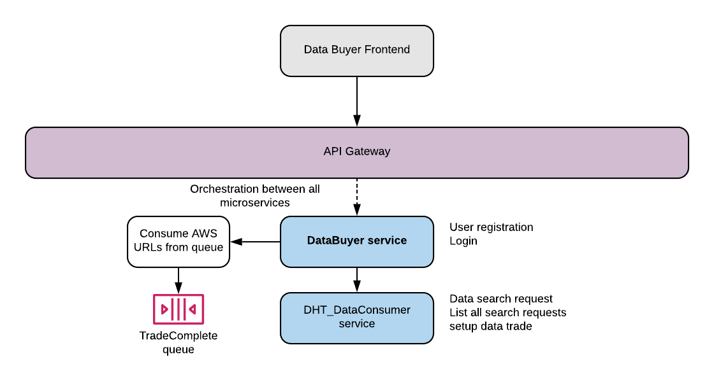
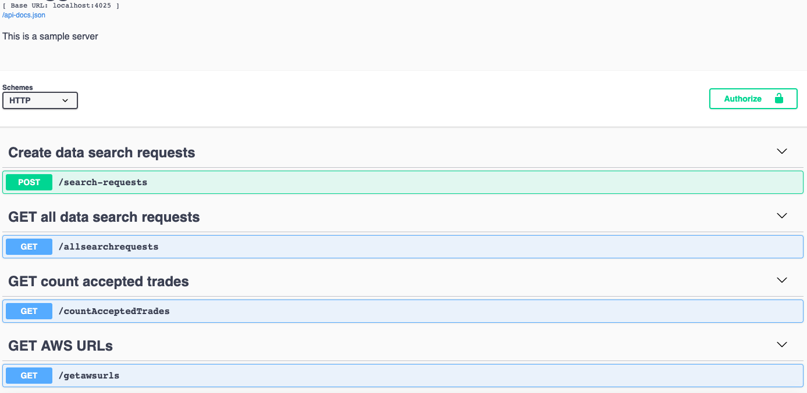

# DHT_DataConsumer
This service handles search requests for data transcations and consumes data from the data provider service.

A full Restful CRUD API for managing dataproviders written in Node.js, Express and MongoDB.



## Steps to setup the service

**Install dependencies**

```bash
$ npm install
```
**Run Server**

```bash
$ npm start
```

**Run the service using make**

```bash
$ make run-all
```

## Run the DataConsumer API
**You can browse the api at:** <http://localhost:4025>

Here are the following API endpoints:



## Run unit tests

```bash
$ npm test
```